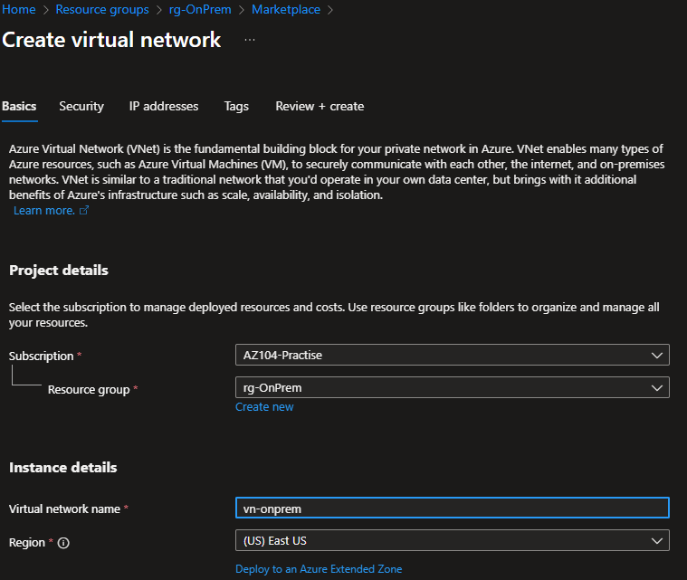
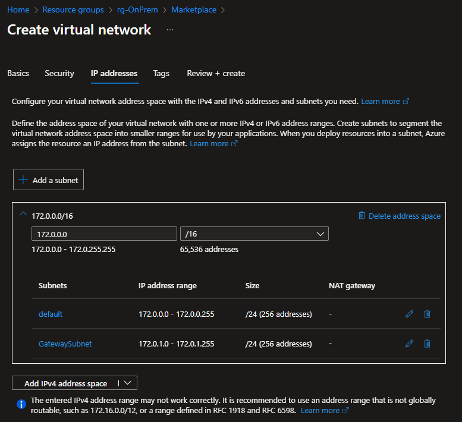
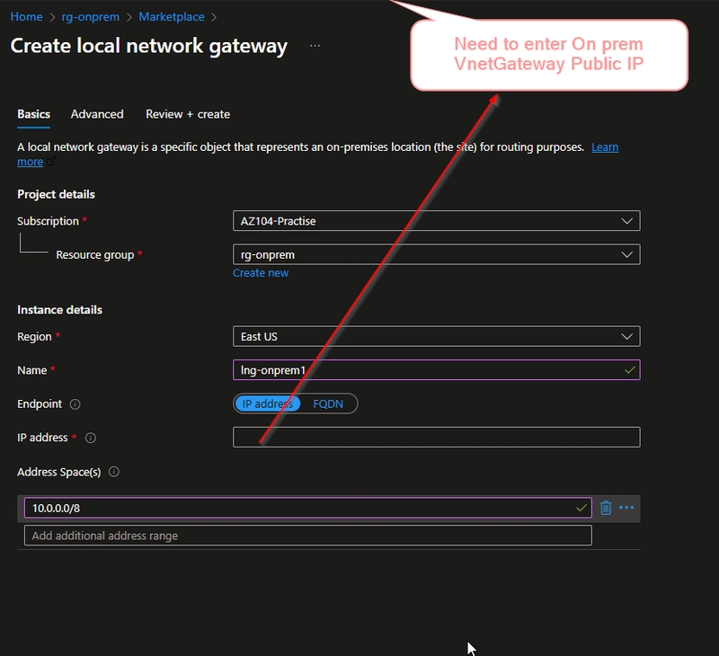
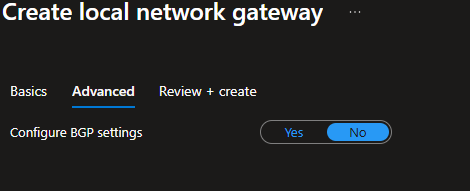
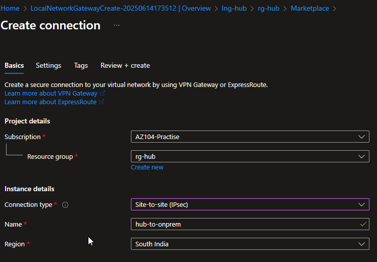
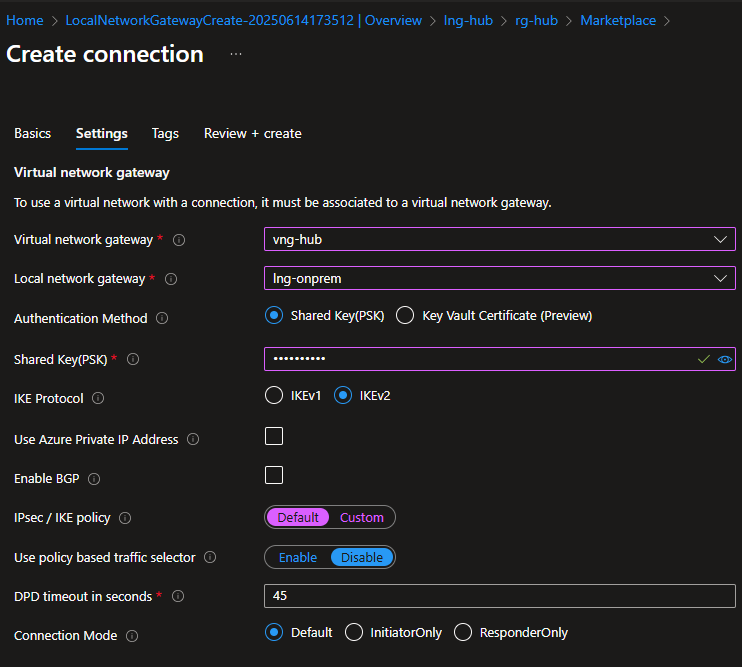
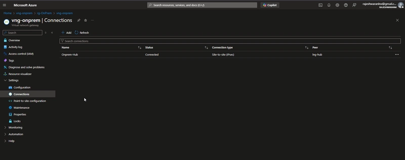
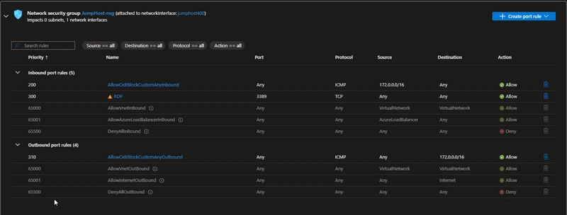
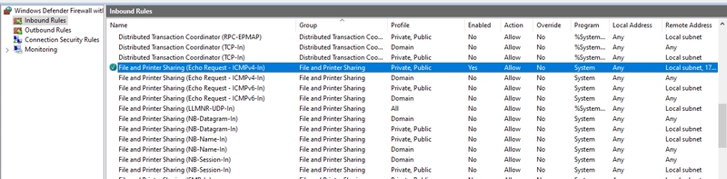
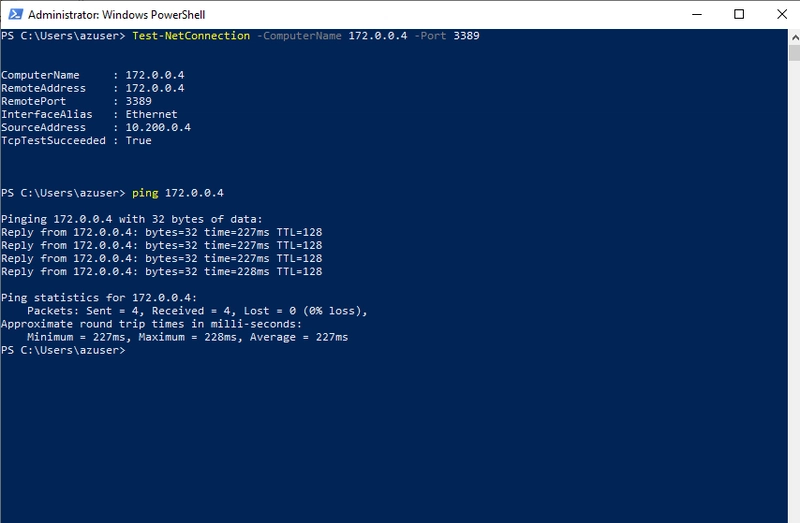

<!DOCTYPE html>
<html lang="en">
<head>
  <meta charset="UTF-8">
  <meta name="viewport" content="width=device-width, initial-scale=1.0">
  <title>Site-to-Site VPN Connection Setup on Azure</title>
  
</head>
<body>

<header>
  <h1>Site-to-Site VPN Connection Setup on Azure</h1>
  
Step-by-step lab project to configure secure VPN connectivity between on-prem and Azure

</header>

<section>
  <h2>📌 Overview</h2>
  
This project demonstrates how to set up a <strong>Site-to-Site (S2S) VPN</strong> between an on-premises environment and Azure.

  
A Site-to-Site VPN is an IPsec VPN tunnel that securely connects two networks over the public internet.

  <ul>
    <li><strong>Example:</strong> Connect your on-premises datacenter/office network to an Azure Virtual Network (VNet).</li>
    <li>After setup, resources on both sides can communicate as if they were on the same local network.</li>
  </ul>
</section>

<section>
  <h2>🔑 What is S2S VPN?</h2>
  
A Site-to-Site VPN connects entire networks together using encrypted IPsec/IKE tunnels.

  <ul>
    <li><strong>On-Prem Network:</strong> 192.168.1.0/24</li>
    <li><strong>Azure VNet:</strong> 10.0.0.0/16</li>
    <li><strong>Example Communication:</strong> 
      <ul>
        <li>Azure VM → On-prem File Server (192.168.1.10)</li>
        <li>On-prem Server → Azure VM (10.0.0.4)</li>
      </ul>
    </li>
  </ul>
  
All traffic between the two networks is <strong>encrypted</strong>.

</section>

<section>
  <h2>🏗️ Lab Environment</h2>
  <ul>
    <li><strong>On-Prem VNet</strong>: 172.0.0.0/16 (Gateway Subnet: 172.0.1.0/27)</li>
    <li><strong>Hub VNet</strong>: 10.100.0.0/16 (Gateway Subnet: 10.100.1.0/27)</li>
    <li><strong>Spoke VNet</strong>: 10.200.0.0/16 (Central India)</li>
    <li><strong>Gateways:</strong> VNet Gateway on OnPrem + Hub, Local Network Gateways for routing</li>
    <li><strong>VPN Connections:</strong> Bidirectional connections between onpremvnet ↔ hubvnet</li>
  </ul>
</section>

<section>
  <h2>⚙️ Setup Steps</h2>
  
  

    <h3>Step 1: Create Resource Groups</h3>
    
Create separate resource groups for hub, spoke, and on-prem VNets.

    
  

  
  

    <h3>Step 2: Create VNets</h3>
    
Create 3 VNets (hub, spoke, on-prem) within the respective resource groups.

    
    
  

  
  

    <h3>Step 3: Create Virtual Network Gateways</h3>
    
Deploy Virtual Network Gateway and Local Network Gateway on both On-Prem and Hub VNets.

    
  

  
  

    <h3>Step 4: Create Local Network Gateways</h3>
    
Enter the on-premises public IP and Azure hub address ranges. Repeat for both Hub & On-Prem.

    
    
  

  
  

    <h3>Step 5: Create VPN Connections</h3>
    
Establish bidirectional connections between on-prem and hub using shared keys.

    
    
    
  

</section>

<section>
  <h2>✅ Validation</h2>
  
Deploy a jump host in the spoke VNet, test connectivity, and configure NSG + Windows Firewall rules for ICMP/RDP.

  
  
  
</section>

<section>
  <h2>📖 References</h2>
  <ul>
    <li><a href="https://learn.microsoft.com/en-us/azure/vpn-gateway/tutorial-site-to-site-portal">Azure S2S VPN Tutorial</a></li>
    <li><a href="https://learn.microsoft.com/en-us/azure/virtual-network-manager/tutorial-create-secured-hub-and-spoke">Hub-Spoke Topology Guide</a></li>
    <li><a href="https://learn.microsoft.com/en-us/azure/vpn-gateway/vpn-gateway-peering-gateway-transit">Gateway Transit in Hub-Spoke</a></li>
  </ul>
</section>

<footer>
  
💡 Written for learning & practice. Feedback welcome! 🚀

</footer>

</body>
</html>
