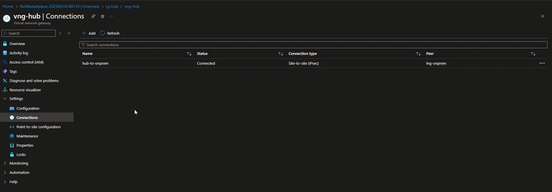

## Site-to-Site VPN Connection Setup on Azure

📌 Overview

This project demonstrates how to set up a Site-to-Site (S2S) VPN between an on-premises environment and Azure.

A Site-to-Site VPN is an IPsec VPN tunnel that securely connects two networks over the public internet.

Example: Connect your on-premises datacenter/office network to an Azure Virtual Network (VNet).

After setup, resources on both sides can communicate as if they were on the same local network.

🔑 What is S2S VPN?

A Site-to-Site VPN (S2S VPN) connects entire networks together using encrypted IPsec/IKE tunnels.

Example setup:

On-Prem Network (Office Router + Firewall): 192.168.1.0/24

Azure VNet: 10.0.0.0/16

With S2S VPN:

A VM in Azure can reach your file server at 192.168.1.10.

An on-prem server can reach a VM in Azure at 10.0.0.4.

All traffic between the two networks is encrypted

🏗️ Lab Environment

This lab simulates an on-premises network inside Azure, and then connects it to a hub-and-spoke Azure network topology using a Site-to-Site VPN.

1. On-Prem VNet

Name: onpremvnet

Address Range: 172.0.0.0/16

Gateway Subnet: 172.0.1.0/27

2. Hub VNet

Name: hubvnet

Address Range: 10.100.0.0/16

Gateway Subnet: 10.100.1.0/27

3. Spoke VNets

Spoke 1: 10.200.0.0/16 (Central India region)

Peered both spokes with the Hub VNet

4. Gateways

VNet Gateway 1: On onpremvnet

VNet Gateway 2: On hubvnet

Local Network Gateway 1: Represents Azure hub on the on-prem side

Local Network Gateway 2: Represents on-prem on the Azure hub side

5. VPN Connections

Connection 1: onpremvnet → hubvnet

Connection 2: hubvnet → onpremvnet

------------------------------------------------------------------ x x x x x x x ------------------------------------------------------------------

## ⚙️ Setup Steps

Step 1: Create Resource Groups

Create separate resource groups for hub, spoke, and on-prem VNets.

Step 2: Create VNets

Create three VNets (hub, spoke, on-prem) within the respective resource groups.

Step 3: Create Virtual Network Gateways

Create a Virtual Network Gateway and a Local Network Gateway for the on-prem VNet and the hub VNet, as shown in the screenshot below.
You can choose any VPN SKU based on your requirements.

SKU: VPNGW1 (for lab/demo).

Disable active-active mode.

Step 4: Create Local Network Gateways

The local network gateway is a specific object deployed to Azure that represents your on-premises location (the site) for routing purposes.

We have created the on-prem virtual network gateway on the on-prem VNet, so you must enter its public IP address when creating the local network gateway.

In the address space field, I used the full range of the hub/spoke network, so I entered 10.0.0.0/8. You can also enter specific hub network address range, such as 10.100.0.0/16.

For the Sake of the lab, leave the BGP setting as it is

Please, repeat the same step for the Hub Network as well.

Step 5: Create VPN Connections

Create a connection profile between the on-prem network and the Azure hub network, and vice versa(bidirectional), and check the connection status

Need to establish the connection from the hub to the on-prem network, as shown in the screenshot below. Repeat the same step for on-prem to hub.

Please keep in mind that when you create a connection between the on-prem network and the hub, you need to set a shared key. Just enter a combination of letters and numbers. You’ll also need to use the same value when creating the connection on the other side.

As you can see in the screenshot below, the connection has been successfully established between both networks.

s2s vpn connection check

Before we check the connection, we should peer the Hub and Spoke network
Please follow the steps to enable the VNet peering between the Hub and Spoke.

In hub-and-spoke network architecture, gateway transit allows spoke virtual networks to share the VPN gateway in the hub, instead of deploying VPN gateways in every spoke virtual network.

Go to the Hub VNet, select the peering option

Peering link name: Name the link. Example: spoke-to-hub
Virtual network deployment model: Resource Manager
I know my resource ID: Leave blank. You only need to select this if you don't have read access to the virtual network or subscription you want to peer with.
Subscription: Select the subscription.
Virtual Network: select the spoke VNet from the dropdown
The peering connection should be configured as shown in the screenshot below

✅ Validation

Deploy a jump host VM inside the spoke VNet.

Test connectivity from the jump host to the on-prem VNet resources.

Verify bidirectional traffic flow.

Create a Windows Jump Host in the spoke VNet. Also, please keep in mind that, by default, Azure blocks ICMP traffic, so we need to add inbound and outbound rules to the Windows Jump Host to allow ICMP. Please refer to the NSG rule below.

One more thing: the Windows machine firewall also blocks ICMP traffic, so you need to enable the following rule in Windows Firewall: File and Printer Sharing (Echo Request - ICMPv4-In).

Also, add the remote IP address range to the scope, as shown in the screenshot below. I spent 3 days finding these settings. 🙂

Open Windows PowerShell on the Jump Host and try the tnc command to check the RDP connection to the remote network as shown in the screenshot below.

Create a Windows machine in the spoke VNet. As you may already know, by default, Azure blocks ICMP traffic, so we need to add inbound and outbound rules to the Windows VM to allow ICMP. Please refer to the NSG rule below.

Here, we also need to modify Windows firewall settings as we did before enabling the File and Printer Sharing (Echo Request - ICMPv4-In) rule.

Open Windows PowerShell on the Windows VM and try the tnc command to check the RDP connection to the remote network, as shown in the screenshot below.

I referred to the following Microsoft document to complete this setup. It took me a long time to figure things out—even though I had Microsoft documentation for reference, I was scratching my head trying to figure out the NSG rule and Windows Firewall. Eventually, I managed to resolve it.

https://learn.microsoft.com/en-us/azure/vpn-gateway/tutorial-site-to-site-portal

https://learn.microsoft.com/en-us/azure/virtual-network-manager/tutorial-create-secured-hub-and-spoke

https://learn.microsoft.com/en-us/azure/vpn-gateway/vpn-gateway-peering-gateway-transit

If I’ve made any mistakes or incorrectly mentioned any steps, please feel free to let me know in the comments section. Happy learning! I’ll try to post another interesting project soon. See you all :)
