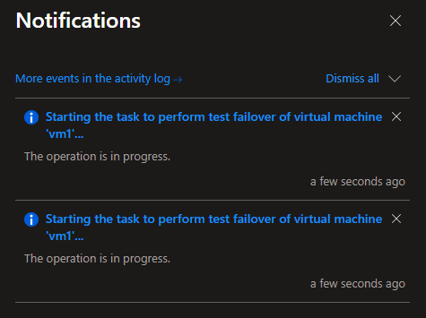

Azure Site Recovery BCDR Strategy

What is Azure Site Recovery

Azure Site Recovery replicates your virtual-machine workloads between Azure regions. You can also use Site Recovery to migrate VMs from other environments, such as on-premises infrastructure, to Azure. You will learn that Site Recovery does much more than just backing up and restoring infrastructure.

With ASR, you can:

Replicate workloads across Azure regions.

Migrate on-premises VMs (VMware, Hyper-V, or physical servers) to Azure.

Protect and recover Azure VMs across paired regions.

ASR provides more than just backup—it delivers orchestrated failover and recovery, ensuring your critical applications remain available.

Multiple data consistency options

Crash Consistency

Snapshot of all data on disk every 5 minutes.
Retention up to 72 hours for application servers.
Application consistency

Snapshot of data on disk + in-memory data every hour.

Retention up to 72 hours for databases.

Multi VM consistency

Consistent recovery points across multiple VMs

Replication group created for all enabled VMs.

Shared crash & app consistent recovery points for all VMs in a group

Platform Support:

Windows OS: Windows Server 2019, Windows Server 2016, Windows Server 2012 R2, Windows Server 2012, Windows Server 2008 R2

Linux OS: RHEL 5,6,7,8 - CentOS 5,6,7,8 - Ubuntu 14.0- 20.04 LTS
SUSE Enterprise Server 11-15, OEL 6-8, Debian 7-9

vSphere & vCenter: 5.5,6.0,6.5,6.7, 7.0

Azure Platform: Managed Disk, Encrypted Storage, Azure Hybrid Benefit

Benefits of Azure Site Recovery

Business Continuity: Keeps workloads running during outages or maintenance.

Cost-Effective: Reduces DR costs by leveraging Azure infrastructure.

Compliance & Reliability: Meets regulatory requirements for disaster recovery.

Scalable & Flexible: Supports hybrid, on-premises, and cloud-native workloads.

Recovery Objectives

RPO (Recovery Point Objective): Defines acceptable data loss (seconds to minutes).

RTO (Recovery Time Objective): Defines how fast workloads can be recovered.

Account Permissions

Site Recovery uses role-based access control in Azure, which enables fine-grained access control and enables you to use several built-in Site Recovery roles

Roles
Site Recovery Contributor- Full permissions for SR operation, suitable for disaster recovery admins

Site Recovery Operator- Operator has permissions to run and administer site recovery failover and failback operations, suitable for disaster recovery operators.

Site Recovery Reader- To view Site Recovery operations, suitable for IT monitoring executives.

Lab Setup:
To set up DR, we will follow the steps below to replicate resources in the target environment.

Step 1:
Create a resource group for both the source and the target environments, as shown in the screenshot below.

Step 2:
Create a Linux VM in the source environment so that we can fail it over to the target location.

Step 3:
Create a VNet and an Azure Recovery Services vault to replicate our source resources.
Also, make sure to create a Recovery Services vault in the target Resource Group.

Step 4:
Go to the Recovery Services vault, click Enable Site Recovery as shown in the screenshot, and enable replication for the VM.

When you enable replication in the target environment’s Recovery Services vault, it automatically installs the Site Recovery Mobility Service extension on the source VMs.

In Azure Site Recovery (ASR), an Automation Account is used to run Recovery Plans with automated scripts during failover and failback operations.
Key Purposes:
Automated Recovery Actions:

Execute PowerShell or Python scripts during failover
Perform custom configuration tasks that can't be handled by ASR alone
Automate post-failover activities like IP address changes, DNS updates, or application-specific configurations

Recovery Plan Enhancement:

Add manual actions and automated scripts between VM groups
Sequence complex multi-tier application recovery
Handle dependencies between different application components

Common Automation Scenarios:

Network Configuration: Update load balancer settings, firewall rules, or network security groups
Application Configuration: Start services, update connection strings, or modify configuration files
DNS Updates: Change DNS records to point to the new environment
Notification: Send alerts or notifications to teams about the failover status

Consistency & Reliability:

Ensures repeatable, standardized recovery procedures
Reduces human error during high-stress disaster situations
Provides audit trails for compliance requirements

Example Use Case:
During a failover, ASR might recover your VMs successfully, but you still need to:

Update your application's database connection string to point to the recovered database
Restart specific services in a particular order
Update external DNS records

The Automation Account handles these tasks automatically through runbooks, making your disaster recovery truly automated rather than just VM recovery.
Note: Automation Account is optional - you only need it if you require custom scripts in your Recovery Plans.

Enable Replication:

Azure Site Recovery has a High Churn option that you can choose to protect VMs with a high data change rate. With this, you can use a Premium Block Blob type of storage account. By default, the Normal Churn option is selected.
Enabling the replication option takes some time, so please wait. It took 51 minutes for me

Step 5:
Run a disaster recovery drill for Azure VMs. Please follow the steps below
In the vault > Replicated items, select the VM and on the Overview page, check that the VM is protected and healthy.

Double-click on the replicated Items and select Test Failover.

In Test Failover, you will be prompted to choose a recovery point. The Azure VM in the target region is created using data from the selected recovery point. Select the Latest one from that list as shown in the screenshot below.

Monitor the test failover in notifications.

After the failover finishes, the Azure VM created in the target region appears in the Azure portal under Virtual Machines. Make sure that the VM is running, sized appropriately, and connected to the network you selected.

Final Step:
Clean up resources
To clean up, select the Cleanup test failover button to clean up the created resources.

Put some notes, and then click OK

you ran a disaster recovery drill to check that failover works as expected. Please feel free to let me know in the comments section if I have made any mistakes. Happy Learning :)

Resources:
Source Region: east-us
Resource Group: asr-source
Vnet: vnet-asr
StorageAccount Cache: szk0h1vaultdrasrcache
VM: vm1
PublicIP: vm1-ip

Target Region: west-us
Resource Group: asr-target
Vnet: vnet-asr-DR
Vault: vault-DR
Automation Account: vault-DR-spe-asr-automationaccount

Reference:

https://learn.microsoft.com/en-us/azure/site-recovery/azure-to-azure-tutorial-enable-replication

https://learn.microsoft.com/en-us/azure/site-recovery/azure-to-azure-tutorial-dr-drill

https://learn.microsoft.com/en-us/azure/site-recovery/azure-to-azure-tutorial-failover-failback
